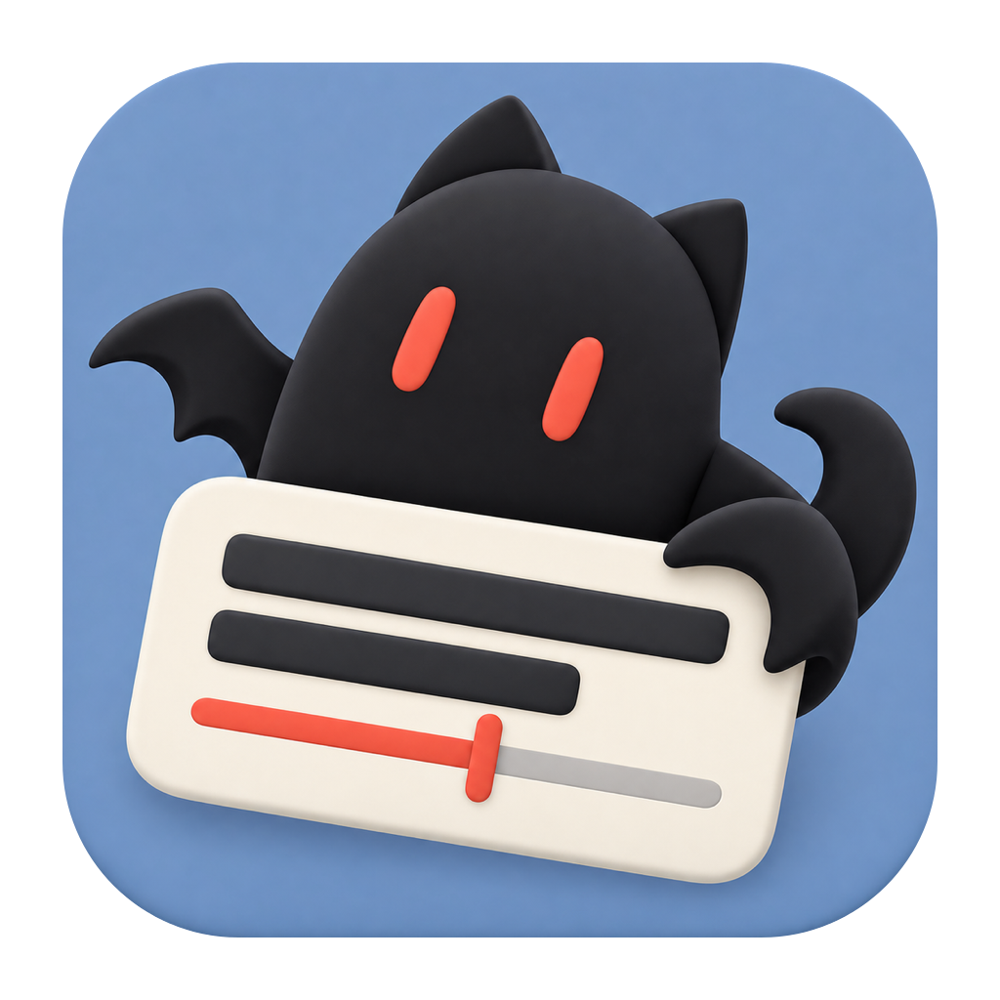

<p align="center">
  
</p>

<h1 align="center">AegiNext</h1>

<p align="center">Modern, native cross-platform subtitle creation</p>

<p align="center">
  <a href="README.md">English</a> · <a href="README.zh-CN.md">简体中文</a>
</p>

<p align="center">
  <a href="docs/en/quick-start.md">Quickstart</a> ·
  <a href="docs/en/README.md">English Docs</a> ·
  <a href="docs/zh-cn/README.md">中文文档</a>
</p>

AegiNext makes subtitle creation easier to learn, supports Aegisub file standards, and runs natively on macOS and Windows. Its goal is to succeed the original Aegisub after its author stopped maintaining it, carrying the subtitle creation workflow forward.


## Features

- **Subtitle creation**: multiple tracks, waveform and spectrogram timing, and ASS/SRT import and export.
- **Styles and effects**: rich text, karaoke, keyframes, motion paths, masks, and reusable scripts.
- **Modern workspace**: dockable panels, light and dark themes, a bilingual interface, and custom shortcuts.
- **Saving and export**: autosave, backup recovery, video encoding in an independent process, and HDR export.

## Quickstart

1. Open the app, create a project, and load media with **File → Open Video**.
2. Select a track, press **F8 / F9** to mark subtitle start and end, then enter the text.
3. Adjust its style, save with **Cmd/Ctrl + S**, and export subtitles through **Format** or video through **Export**.

## Run from source

Install the .NET SDK and PowerShell required by the repository. Run the following commands from its root.

### Install dependencies

Dependency installation uses Homebrew on macOS and Scoop on Windows. For Windows release packaging, also install NSIS:

```powershell
scoop bucket add extras
scoop install nsis
```

Install missing build dependencies and build the workbench:

```powershell
pwsh -NoProfile -File ./build.ps1 -Target Workbench -InstallDependencies
```

### Build

For subsequent builds:

```powershell
pwsh -NoProfile -File ./build.ps1 -Target Workbench -Configuration Release
```

### Release

```powershell
pwsh -NoProfile -File ./release.ps1
```

Run on the target OS to create a macOS DMG or Windows NSIS installer. Packages are written to a new directory under `artifacts/releases/`.

See [Building](docs/en/building.md) for setup, launching, and debugging, or [Publishing](docs/en/publishing.md) for packaging.

## License

GPLv3.
